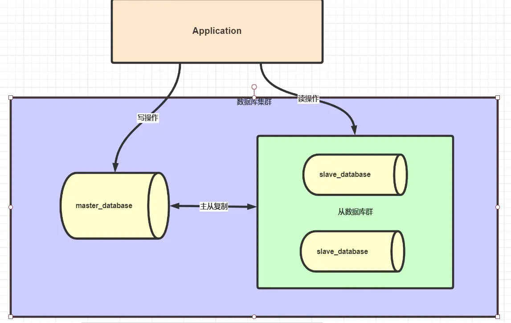
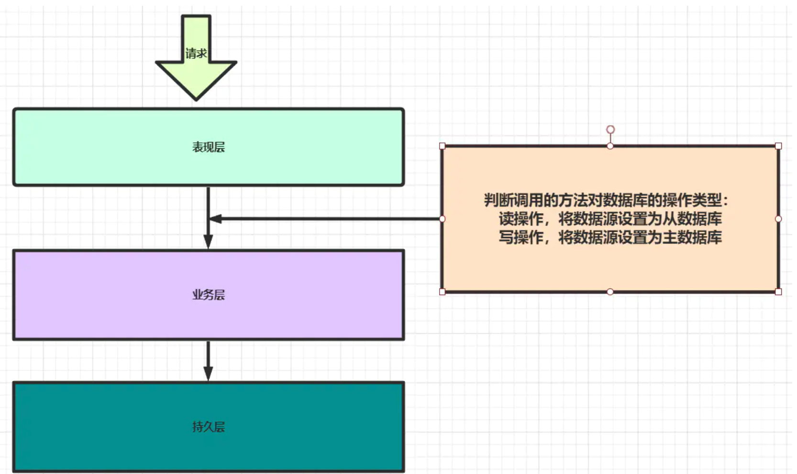

学习笔记

##### 第13节课作业实践

###### 一、按照自己设计的表结构，插入100万订单模拟数据，测试不同方式的插入效率。

[代码](./lesson07/src/main/java/com/lesson007/demo/Test.java)

1. 使用JDBC preparedStatement.executeUpdate


如果不关闭连接，不关闭Connection的时候，就会出现下面的错误
```
java.sql.SQLNonTransientConnectionException:
	 Data source rejected establishment of connection,  message from server: "Too many connections"
```

connection 用一次，然后释放一次。总共使用了100万次，再释放100万。
如果不释放，那么就会出现上述错误，Too many connections

耗时：6个小时
耗时点
1) Faker
2) 每一次都重新获取connection

```
    public void insert() {
        Connection connection = null;
        PreparedStatement preparedStatement = null;

        try {
            Long start = System.currentTimeMillis();
            for(int i = 0; i < 1000000; i++){
                connection = Test.getConnection();
                String sql = "INSERT INTO tb_user (id, create_time, update_time," +
                        " name, age, phone, address, status, nickname," +
                        " certificate_no) values (?,?,?,?,?,?,?,?,?,?)";
                preparedStatement = connection.prepareStatement(sql);

                Faker faker = new Faker();

                preparedStatement.setInt(1,2+i);
                preparedStatement.setTimestamp(2, Timestamp.valueOf(LocalDateTime.now()));
                preparedStatement.setTimestamp(3, Timestamp.valueOf(LocalDateTime.now()));
                preparedStatement.setString(4, faker.name());
                preparedStatement.setInt(5, (int) (Math.random() * 100));
                preparedStatement.setLong(6, new Random().nextLong());
                preparedStatement.setString(7, faker.stateAbbr());
                preparedStatement.setInt(8, 1);
                preparedStatement.setString(9, faker.lastName());
                preparedStatement.setString(10, new Random().nextLong()+"");

                // 返回影响的行数
                int num = preparedStatement.executeUpdate();
                Test.releaseDB(connection, preparedStatement, null);
            }
            long end = System.currentTimeMillis();
            System.out.println("耗时"+(end - start));
        } catch (SQLException e) {
            e.printStackTrace();
        } finally {
            Test.releaseDB(connection, preparedStatement, null);
        }
    }
```

2. 使用JDBC PreparedStatement executeBatch();

耗时：204秒

改进点   

1）整个过程 connection 只使用一次，大大减少了创建connection和销毁的过程

2) 使用addBatch，将100万的数据编译一次，传递给MySQL执行。

``` 
    public void insertBatch() {
        Connection connection = null;
        PreparedStatement preparedStatement = null;
        try {
            long start = System.currentTimeMillis();
            connection = Test.getConnection();
            //Statement statement = connection.createStatement();
            connection.setAutoCommit(false);
            String sql = "INSERT INTO tb_user (id, create_time, update_time," +
                    " name, age, phone, address, status, nickname," +
                    " certificate_no) values (?,?,?,?,?,?,?,?,?,?)";

            preparedStatement = connection.prepareStatement(sql);
            for(int i = 0; i< 1000000; i++){
                preparedStatement.setInt(1,2+i);
                preparedStatement.setTimestamp(2, Timestamp.valueOf(LocalDateTime.now()));
                preparedStatement.setTimestamp(3, Timestamp.valueOf(LocalDateTime.now()));
                preparedStatement.setString(4, "张三"+i);
                preparedStatement.setInt(5, (int) (Math.random() * 100));
                preparedStatement.setLong(6, new Random().nextLong());
                preparedStatement.setString(7, "北京市"+i);
                preparedStatement.setInt(8, 1);
                preparedStatement.setString(9, "zhangsan"+i);
                preparedStatement.setString(10, new Random().nextLong()+"");
                preparedStatement.addBatch();
                System.out.println("index ->"+i);
            }
            // statement.addBatch(sql);

            int[] resultCount = preparedStatement.executeBatch();
            connection.commit();
            long end = System.currentTimeMillis();
            System.out.println("耗时->"+(end - start));
        } catch (SQLException e) {
            try {
                connection.rollback();
            } catch (SQLException ex) {
                ex.printStackTrace();
            }
            e.printStackTrace();
        }finally {
            Test.releaseDB(connection, null, null);
        }
    }
```

3) 使用 Statement addBatch

耗时：214秒

虽然Statement 和 PreparedStatement 耗时没有差多少，
但是在里面拼接SQL就非常之难受。

```
    public void insertBatch2() {
        Connection connection = null;
        try {
            long start = System.currentTimeMillis();
            connection = Test.getConnection();
            connection.setAutoCommit(false);

            Statement statement = connection.createStatement();
            for(int i = 0; i< 1000000; i++){
                Timestamp createTime = Timestamp.valueOf(LocalDateTime.now());
                Timestamp updateTime = Timestamp.valueOf(LocalDateTime.now());
                String name = "张三"+i;
                Integer age = (int) (Math.random() * 100);
                Long phone = new Random().nextLong();
                String address = "北京市"+i;
                Integer status = 1;
                String nickName = "zhangsan"+i;
                String certificateNo = new Random().nextLong()+"";
                String sql = "INSERT INTO tb_user (id, create_time, update_time," +
                        " name, age, phone, address, status, nickname," +
                        " certificate_no) values ("+i+",'"+createTime+"','"+updateTime+"','"+name
                        +"',"+age+","+phone+",'"+address+"',"+status+",'"+nickName+"',"+certificateNo+");";
                statement.addBatch(sql);
                //System.out.println("sql=>"+sql);
                System.out.println("index ->"+i);
            }
            statement.executeBatch();
            connection.commit();
            long end = System.currentTimeMillis();
            System.out.println("耗时->"+(end - start));
        } catch (SQLException e) {
            try {
                connection.rollback();
            } catch (SQLException ex) {
                ex.printStackTrace();
            }
            e.printStackTrace();
        }finally {
            Test.releaseDB(connection, null, null);
        }
    }
```

4) 使用MySQl的存储过程

TODO

##### 第14节课作业实践

[Docker方式实现MySQL主从复制](https://www.jianshu.com/p/661f70a7274e)
[Docker安装MySQL](https://www.jianshu.com/p/d9b6bbc7fd77)

准备工作，使用Docker配置MySQL的主从复制

``` 
1）使用Docker运行MySQL容器
docker run -di --name=master_mysql -p 33309:3306 -e MYSQL_ROOT_PASSWORD=root mysql:5.7
使用docker配置主
表示这个容器中使用3306（第二个）映射到本机的端口号为33309（第一个） 
mysql -u root -h 127.0.0.1 -P 33309 -p
通过这个可以访问主库


docker run -di --name=slave_mysql -p 33306:3306 -e MYSQL_ROOT_PASSWORD=root mysql:5.7

2) 进入Docker的主中
docker exec -it master_mysql /bin/bash

apt-get update
apt-get install vim

3) 编辑主的配置文件
cd /etc/mysql
编辑 my.cnf

主
[mysqld]
server-id=10
log-bin=mysql-bin
innodb_flush_log_at_trx_commit=1
sync_binlog=1


docker restart master_mysql

4) 再主上面创建slave用户名，并配置权限

docker exec -it master_mysql /bin/bash
mysql -uroot -proot

CREATE user 'slave'@'%' identified by 'slave';
GRANT REPLICATION SLAVE, REPLICATION CLIENT ON *.* TO 'slave'@'%';


5) 配置从
docker exec -it slave_mysql /bin/bash
cd /etc/mysql
编辑 my.cnf

从

[mysqld]
server-id=11
log-bin=mysql-slave-bin
relay_log=edu-mysql-relay-bin

docker restart slave_mysql


6) 配置从连接到主的master
docker inspect --format='{{.NetworkSettings.IPAddress}}' master_mysql

docker exec -it slave_mysql /bin/bash
mysql -uroot -proot

change master to master_host='172.17.0.2', master_user='slave', master_password='slave', master_port=3306, master_log_file='mysql-bin.000001', master_log_pos=617, master_connect_retry=30;

```


###### 一、读写分离-动态切换数据源版本1.0


1、测试写主库

``` 
    @Test
    public void testWrite() {
        Person person = new Person();
        person.setName("zhangsan");
        person.setAge(18);
        personService.add(person);
    }
```


``` 
 com.lesson007.demo.ApplicationTest       : Started ApplicationTest in 2.43 seconds (JVM running for 3.548)
 c.l.config.DynamicSwitchDBTypeUtil       : 切换数据源:MASTER
 com.zaxxer.hikari.HikariDataSource       : HikariPool-1 - Starting...
 com.zaxxer.hikari.HikariDataSource       : HikariPool-1 - Start completed.
 com.lesson007.dao.PersonMapper.insert    : ==>  Preparing: INSERT INTO person ( name,age ) VALUES( ?,? ) 
 com.lesson007.dao.PersonMapper.insert    : ==> Parameters: zhangsan(String), 18(Integer)
 com.lesson007.dao.PersonMapper.insert    : <==    Updates: 1
 com.zaxxer.hikari.HikariDataSource       : HikariPool-1 - Shutdown initiated...
 com.zaxxer.hikari.HikariDataSource       : HikariPool-1 - Shutdown completed.

```

2、测试读从库

``` 
    @Test
    public void testQuery() {
        List<Person> all = personService.findAll();
        all.forEach(System.out::println);
    }
```


``` 
 c.l.config.DynamicSwitchDBTypeUtil       : 切换数据源:SLAVE
 com.zaxxer.hikari.HikariDataSource       : HikariPool-1 - Starting...
 com.zaxxer.hikari.HikariDataSource       : HikariPool-1 - Start completed.
 c.lesson007.dao.PersonMapper.selectAll   : ==>  Preparing: SELECT name,age FROM person 
 c.lesson007.dao.PersonMapper.selectAll   : ==> Parameters: 
 c.lesson007.dao.PersonMapper.selectAll   : <==      Total: 2
```


3、原理







1）创建两个注解 read，write

只要在方法上加了**read**注解那么表示该方法对数据库的操作是读操作

``` 
    PersonService
	  /***
     * 代表该方法对数据库的操作是一个读操作
     * @return
     */
    @Read
    public List<Person> findAll() {
        return personMapper.selectAll();
    }
```

只要在方法上加了**write**注解那么表示该方法对数据库的操作是写操作

``` 
PersonService
    /***
     * 代表该方法对数据库的操作是一个写操作
     * @param person
     */
    @Write
    public void add(Person person) {
        personMapper.insert(person);
    }
```


2) 创建动态切换数据源的工具

``` 
DynamicSwitchDBTypeUtil

    /**
     * 用来存储代表数据源的对象
     *  如果是里面存储是SLAVE，代表当前线程正在使用主数据库
     *  如果是里面存储的是SLAVE,代表当前线程正在使用从数据库
     */
    private static final ThreadLocal<DBTypeEnum> CONTEXT_HAND = new ThreadLocal<>();

```


3) SpringBoot提供了**AbstractRoutingDataSource**，用户根据自己需要自定义的规则去选择当前要使用的数据源

我们在调用业务层方法之前去扫描注解，如果方法上是**read**注解，我们就切换到从数据库，否则就切换到主数据库。

``` 
public class RouttingDataSource extends AbstractRoutingDataSource {
    @Override
    protected Object determineCurrentLookupKey() {
        /***
         * 返回当前线程正在使用的代表数据库的枚举对象
         */
        return DynamicSwitchDBTypeUtil.get();
    }
}
```

4) 配置数据源

``` 
DataSourceConfig

    /***
     * 将创建的master数据源存入Spring容器中，并且注入内容
     * @return
     */
    @Bean
    @ConfigurationProperties("spring.datasource.master")
    public DataSource masterDataSource() {
        return DataSourceBuilder.create().build();
    }

    /***
     * 将创建的slave数据源存入Spring容器中，并且注入内容
     * @return
     */
    @Bean
    @ConfigurationProperties("spring.datasource.slave")
    public DataSource slaveDataSource() {
        return DataSourceBuilder.create().build();
    }

    /***
     * 决定最终要使用的数据源
     * @param masterDataSource
     * @param slaveDataSource
     * @return
     */
    @Bean
    public DataSource targetDataSource(@Qualifier("masterDataSource") DataSource masterDataSource,
                                       @Qualifier("slaveDataSource") DataSource slaveDataSource) {
        // 存放主数据源和从数据源
        Map<Object, Object> targetDataSource = new HashMap<>();

        // 往map中添加主数据源
        targetDataSource.put(DBTypeEnum.MASTER, masterDataSource);
        // 往map中添加从数据源
        targetDataSource.put(DBTypeEnum.SLAVE, slaveDataSource);

        // 创建 routtingDataSource 用来实现动态切换
        RouttingDataSource routtingDataSource = new RouttingDataSource();
        // 绑定所有的数据源
        routtingDataSource.setTargetDataSources(targetDataSource);
        // 设置默认的数据源
        routtingDataSource.setDefaultTargetDataSource(masterDataSource);

        return routtingDataSource;
    }
```

5) 配置切面

我们可以利用aop的思想，配置切入点的通知，在调用每一个方法之前去判断，然后切换使用的数据源

``` 
DataSourceAOP

    /***
     * 只要加了@Read注解的方法就是一个切入点
     */
    @Pointcut("@annotation(com.lesson007.config.Read)")
    public void readPointcut() {
    }

    @Pointcut("@annotation(com.lesson007.config.Write)")
    public void writePointcut() {
    }

    /***
     * 配置前通知，如果是readPoint 就切换数据源为从数据库
     */
    @Before("readPointcut()")
    public void readAdvise() {
        DynamicSwitchDBTypeUtil.slave();
    }

    /***
     * 配置前通知，如果wirtePoint就切换数据源为主数据库
     */
    @Before("writePointcut()")
    public void writeAdvise() {
        DynamicSwitchDBTypeUtil.master();
    }
```


参考

[读写分离](https://github.com/smallCodeWangzh/application)

[SpringBoot+MyBatis实现读写分离](https://www.jianshu.com/p/88cfd302c9d2)

###### 二、读写分离-数据库框架版本2.0 

TODO
